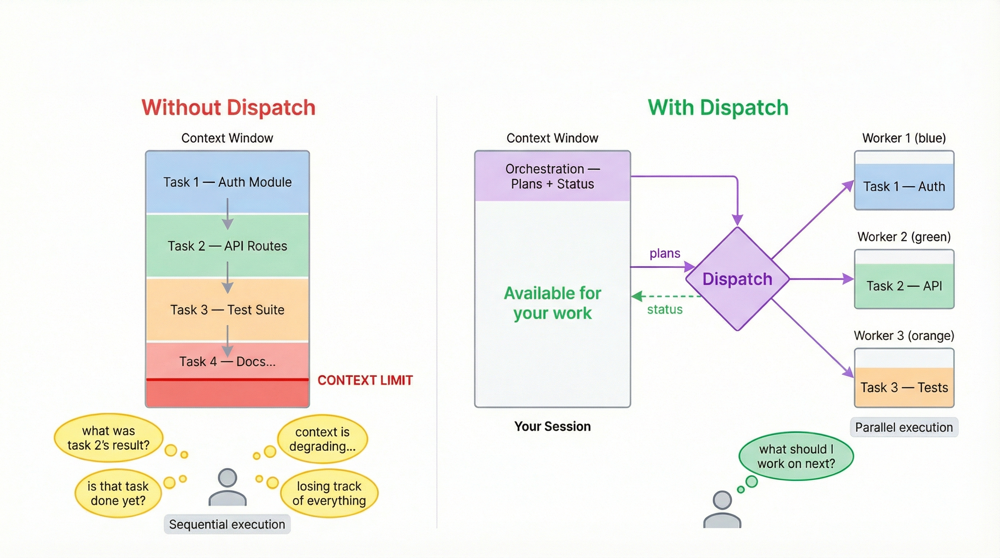
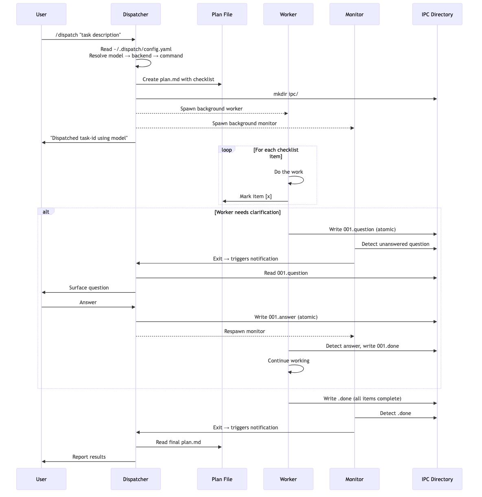

<h1>/dispatch&nbsp;</h1>

**Your Claude Code session is the most expensive context window you have. Stop filling it with implementation.** `/dispatch` turns it into a lightweight orchestrator — work fans out to background agents, and the dispatcher bears the cognitive load of tracking it all, so you don't have to.

<p align="center">
  
</p>

> **Without dispatch:** You ask Claude to review code, refactor a module, write tests, and update docs. Each task fills the context window. By task 3, Claude is losing track of earlier work. By task 5, you're starting a new session. You're also the one remembering what's done, what's pending, and what broke.
>
> **With dispatch:** You describe all 5 tasks. The dispatcher plans them as checklists, fans them out to separate workers, and tracks progress. Your main session stays at ~5% context usage. Workers each get full, fresh context. When a worker has a question, it surfaces to you. When it's done, you get a summary. You never poll, you never forget, you never lose context.

Opening more terminals doesn't fix this — it trades context exhaustion for cognitive overload, since _you're_ still the one tracking what's running where. Fire-and-forget background agents give you parallelism but leave the coordination burden on you. Dispatch gives you both: parallel execution with the AI managing the coordination.

```
/dispatch use sonnet to find better design patterns for the auth module
```

---

## Why dispatch

### 10x your effective context

A Claude Code session has a finite context window. Every file it reads, every refactor it performs, every test it writes — that's context consumed. Once the window fills, quality degrades or the session dies.

Dispatch inverts this: the main session becomes a **mediator**, not the thinker. It writes a checklist and hands it off. The actual implementation — reading code, reasoning about edge cases, writing tests — happens in fresh worker contexts that each get their own full window. Your main session's context is preserved for orchestration.

Without dispatch, doing 5 sequential tasks consumes your entire context window. With dispatch, those 5 tasks each get their own full context, and your main session barely uses any.

### The dispatcher carries the cognitive load

This is the key differentiator from other background agent tools. With `claude --background`, multiple terminals, or fire-and-forget agent runners — _you_ are the orchestrator. You track what's running, check on progress, notice failures, and context-switch between outputs. The cognitive load is on the human.

With dispatch, the AI dispatcher tracks all workers, surfaces questions, reports completions, handles errors, and offers recovery. Your job reduces to: **(a)** describe what you want, **(b)** answer questions when asked. The bottleneck shifts from your working memory to the dispatcher's capacity.

### Workers ask questions back

This is the part most agent orchestrators get wrong. When a `/dispatch` worker gets stuck, it doesn't silently fail or hallucinate. It **asks a clarifying question** — the dispatcher surfaces it to you, you answer, and the worker continues **without losing context**. No restart, no re-explaining, no lost work.

```
Worker is asking: "requirements.txt doesn't exist. What feature should I implement?"
> Add a /health endpoint that returns JSON with uptime and version.

Answer sent. Worker is continuing.
```

### Non-blocking — you never wait

The moment a worker is dispatched, your session is **immediately free**. Dispatch another task. Ask a question. Write code. The dispatcher handles multiple workers in parallel, reports results as they arrive, and surfaces questions only when they need your input. No polling, no tab-switching, no "is it done yet?"

### Any model, one interface

Mix models per task. Claude for deep reasoning, GPT for broad generation, Gemini for speed. Reference any model by name — if it's not in your config, `/dispatch` auto-discovers and adds it. If multiple models are named in one prompt, dispatch uses the last one mentioned.

```
/dispatch use opus to review this PR for edge cases
/dispatch use gemini to refactor the config parser — it's getting unwieldy
```

### How is this different?

| | Single session | `claude --background` / multiple terminals | `/dispatch` |
|---|---|---|---|
| **Context usage** | Consumed by implementation | Each terminal independent, but uncoordinated | Main session preserved; workers get fresh contexts |
| **Cognitive burden** | You track everything | You track everything across more windows | Dispatcher tracks, you answer questions |
| **Parallel execution** | Sequential | Possible, coordination is manual | Built-in with status + Q&A routing |
| **Recovery from blockers** | Re-explain from scratch | Re-explain from scratch | Clarify in-place, worker continues with full context |

---

> **Requires [Claude Code](https://docs.anthropic.com/en/docs/claude-code) as your host session.** Dispatch is a skill that runs _inside_ Claude Code — the host plans tasks and spawns workers. Other CLIs like [Cursor](https://docs.cursor.com/) and [Codex](https://github.com/openai/codex) work as **workers only** (background agents that execute subtasks).

## Install

```bash
npx skills add bassimeledath/dispatch -g     # user-level (all projects)
npx skills add bassimeledath/dispatch        # project-level (team-shared)
```

## How it works

1. You run `/dispatch task description`
2. A checklist plan is created — *the only context your main session needs*
3. A background worker picks it up in a **fresh, full context window** and checks off items as it goes
4. If the worker has a question, it asks — you answer — it continues *(no context lost in either direction)*
5. You get results when it's done, or ask for status anytime — *your main session is still lean*

## Setup

On first run, `/dispatch` auto-detects your CLIs (`claude`, `agent`, `codex`), discovers available models, and generates `~/.dispatch/config.yaml`. No manual config needed.

## Configuration

Three sections in `~/.dispatch/config.yaml`:

**Backends** — CLI commands for each provider:
```yaml
backends:
  claude:
    command: >
      env -u CLAUDE_CODE_ENTRYPOINT -u CLAUDECODE
      claude -p --dangerously-skip-permissions
  cursor:
    command: >
      agent -p --force --workspace "$(pwd)"
  codex:
    command: >
      codex exec --full-auto -C "$(pwd)"
```

**Models** — one line each, mapped to a backend:
```yaml
models:
  opus:            { backend: claude }
  sonnet:          { backend: claude }
  gpt-5.3-codex:  { backend: codex }
  gemini-3.1-pro:  { backend: cursor }
```

**Aliases** — named shortcuts with optional role prompts:
```yaml
aliases:
  security-reviewer:
    model: opus
    prompt: >
      You are a security-focused reviewer. Prioritize OWASP Top 10.
```

## Prerequisites

**Host (required):**
- [Claude Code](https://docs.anthropic.com/en/docs/claude-code) (`claude`)

**Workers (optional — for multi-model dispatch):**
- [Cursor CLI](https://docs.cursor.com/) (`agent`)
- [Codex CLI](https://github.com/openai/codex) (`codex`)
- Any CLI that accepts a prompt argument

## Updating

**Skills CLI (recommended):**

```bash
npx skills update
```

This updates all installed skills to their latest versions. Run `npx skills check` first to see what's changed.

**Symlinked to a local clone?** If your `.claude/skills/dispatch` is a symlink to a local git checkout, just pull:

```bash
cd /path/to/your/dispatch && git pull
```

Changes are picked up immediately — Claude Code hot-reloads skills from disk.

## Architecture

The dispatcher reads your config, creates a checklist plan, then spawns a background worker and monitor. The worker executes each item and checks it off. If it needs clarification, it writes a question to the IPC directory — the monitor detects it and notifies the dispatcher, which surfaces it to you and relays your answer back, all without the worker losing context.

<p align="center">
  
</p>

## License

MIT
